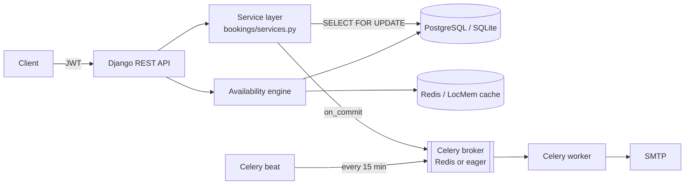

# Reservo

[](https://github.com/ebrahimmorkas/reservo/actions/workflows/ci.yml)


**Reservo** is a production-style REST API for appointment booking, the kind of backend behind
barbershop, clinic or fitness-studio scheduling apps. Providers publish services and opening
hours. Customers see real-time availability and book, reschedule or cancel appointments.
Email confirmations and reminders are sent in the background.

The project focuses on the hard parts of a booking system: **preventing double bookings under
concurrent load**, **time-zone-correct availability**, **cache invalidation** and **reliable
background jobs**.

---

## Highlights

| Area | What's implemented |
| --- | --- |
| **API** | Django REST Framework, versioned under `/api/v1/`, OpenAPI 3 schema, Swagger UI & ReDoc |
| **Auth** | Email-based custom user, JWT (access + rotating refresh), logout via token blacklist, role-based permissions |
| **Concurrency** | Row-level locking (`SELECT ... FOR UPDATE`) + DB re-validation, covered by a multi-threaded race test on PostgreSQL |
| **Availability engine** | Time-zone aware, multiple opening windows per day, service buffers, time off, minimum notice, booking horizon |
| **Caching** | Versioned cache keys bumped on commit, so stale availability is never served. Uses Redis or local memory |
| **Background jobs** | Celery tasks for confirmation, cancellation and reschedule emails; idempotent reminder job run by Celery beat |
| **Quality** | 60 pytest tests, 96% coverage, Ruff lint/format, GitHub Actions matrix (SQLite & PostgreSQL+Redis) |
| **Ops** | Multi-stage Docker image (non-root), docker-compose with Postgres, Redis, worker and beat; health-check endpoint |

## Architecture



```
apps/
├── accounts/       # custom User model, JWT auth endpoints
├── catalog/        # Business & Service
├── scheduling/     # WorkingHours, TimeOff, slot engine + cache
├── bookings/       # Booking model, service layer (locking, lifecycle rules), API
├── notifications/  # Celery tasks, email templates, reminder job
└── core/           # health check, error envelope, permissions, pagination
config/
├── settings/       # base / local / test / production
└── celery.py
```

## Redis is optional

Every external service is opt-in through environment variables:

| Variable | Set | Not set |
| --- | --- | --- |
| `DATABASE_URL` | PostgreSQL (or any DB URL) | SQLite file |
| `REDIS_URL` | Redis cache + Celery broker/result backend | In-memory cache, Celery tasks run **eagerly in-process** |
| `CELERY_BROKER_URL` | Overrides the broker independently of the cache | Falls back to `REDIS_URL` |

CI runs the whole suite in **both** modes on every push.

## Quick start

### Option A: local, no external services

```bash
python -m venv .venv && source .venv/bin/activate    # Windows: .venv\Scripts\activate
pip install -r requirements-dev.txt
cp .env.example .env
python manage.py migrate
python manage.py seed_demo          # demo provider, business, services & opening hours
python manage.py runserver
```

Open <http://localhost:8000/api/docs/> for the interactive Swagger UI.

### Option B: full stack with Docker

```bash
docker compose up --build
docker compose exec web python manage.py seed_demo
```

This starts gunicorn, PostgreSQL, Redis, a Celery worker and Celery beat.

## API tour

```bash
# 1. Log in as the demo customer
TOKEN=$(curl -s -X POST localhost:8000/api/v1/auth/token/ \
  -H 'Content-Type: application/json' \
  -d '{"email":"customer@reservo.dev","password":"demo-pass-123"}' | jq -r .access)

# 2. Browse services and check availability
curl -s 'localhost:8000/api/v1/services/?business=urban-fade-barbers'
curl -s 'localhost:8000/api/v1/services/1/availability/?date=2026-10-12'

# 3. Book a slot
curl -s -X POST localhost:8000/api/v1/bookings/ -H "Authorization: Bearer $TOKEN" \
  -H 'Content-Type: application/json' \
  -d '{"service":1,"starts_at":"2026-10-12T09:00:00+01:00","notes":"Skin fade"}'
```

| Method | Endpoint | Description |
| --- | --- | --- |
| `POST` | `/api/v1/auth/register/` | Create customer/provider account |
| `POST` | `/api/v1/auth/token/` · `/token/refresh/` · `/logout/` | JWT lifecycle |
| `GET/PATCH` | `/api/v1/auth/me/` | Current user profile |
| `GET/POST` | `/api/v1/businesses/` | List (public) / create (providers) |
| `GET/POST` | `/api/v1/services/` | Filter by `business`, `min_price`, `max_price`, `max_duration` |
| `GET` | `/api/v1/services/{id}/availability/?date=` | Bookable start times for a day |
| `CRUD` | `/api/v1/working-hours/` · `/api/v1/time-off/` | Provider schedule management |
| `GET/POST` | `/api/v1/bookings/` | List own bookings (`role`, `status`, date filters) / book |
| `POST` | `/api/v1/bookings/{id}/cancel/` · `reschedule/` | Customer or provider |
| `POST` | `/api/v1/bookings/{id}/complete/` · `no-show/` | Provider records the outcome |
| `GET` | `/api/v1/health/` | DB + cache health probe |

Errors always use the same envelope:

```json
{ "error": { "code": "slot_unavailable", "message": "The requested time slot is no longer available." } }
```

## Design decisions

**Preventing double bookings.** Checking availability and then inserting is a classic race:
two requests can both see the slot as free. `create_booking` locks the business row with
`SELECT ... FOR UPDATE` and re-computes availability **from the database, bypassing the
cache** while the lock is held. Concurrent requests for the same business are serialised.
`test_concurrency.py` fires 8 threads at one slot and asserts exactly one booking is created.

**Cache invalidation without key scanning.** Slot lists are cached under
`slots:{business}:v{version}:...`. Any change to hours, time off, services or bookings bumps the
business' version number, so old entries simply become unreachable and expire. The bump runs in
`transaction.on_commit`, so a concurrent reader can't re-cache data from before the commit.

**Time zones.** Opening hours are stored as local wall-clock times plus the business' IANA
time zone. Slots are generated in local time and returned as UTC-aware datetimes, so DST
transitions are handled correctly. Emails render in the business' local time.

**Reliable notifications.** Tasks are queued only after the transaction commits, so a
rolled-back booking never sends an email. They retry with exponential backoff. The reminder
job "claims" each booking with a conditional `UPDATE ... WHERE reminder_sent_at IS NULL`,
which makes it safe to run concurrently or more than once.

**Thin views, fat services.** Business rules live in `apps/bookings/services.py`, not in
serializers or views, which keeps them easy to test and reuse (for example, from the admin or
a future CLI).

## Running tests

```bash
pytest                                   # SQLite, no Redis
pytest --cov                             # with coverage
DATABASE_URL=postgres://... REDIS_URL=redis://... pytest   # same suite on Postgres + Redis
ruff check . && ruff format --check .
```

## Configuration reference

| Variable | Default | Purpose |
| --- | --- | --- |
| `RESERVO_SLOT_STEP_MINUTES` | `15` | Granularity of offered start times |
| `RESERVO_MIN_NOTICE_MINUTES` | `60` | How soon a slot can be booked |
| `RESERVO_BOOKING_HORIZON_DAYS` | `90` | How far ahead bookings are allowed |
| `RESERVO_CANCELLATION_WINDOW_HOURS` | `2` | Customers cannot change bookings after this |
| `RESERVO_REMINDER_LEAD_HOURS` | `24` | When reminder emails go out |
| `JWT_ACCESS_MINUTES` / `JWT_REFRESH_DAYS` | `30` / `7` | Token lifetimes |
| `THROTTLE_ANON` / `THROTTLE_USER` / `THROTTLE_AUTH` | `60/min` / `300/min` / `10/min` | Rate limits |

## License

MIT
